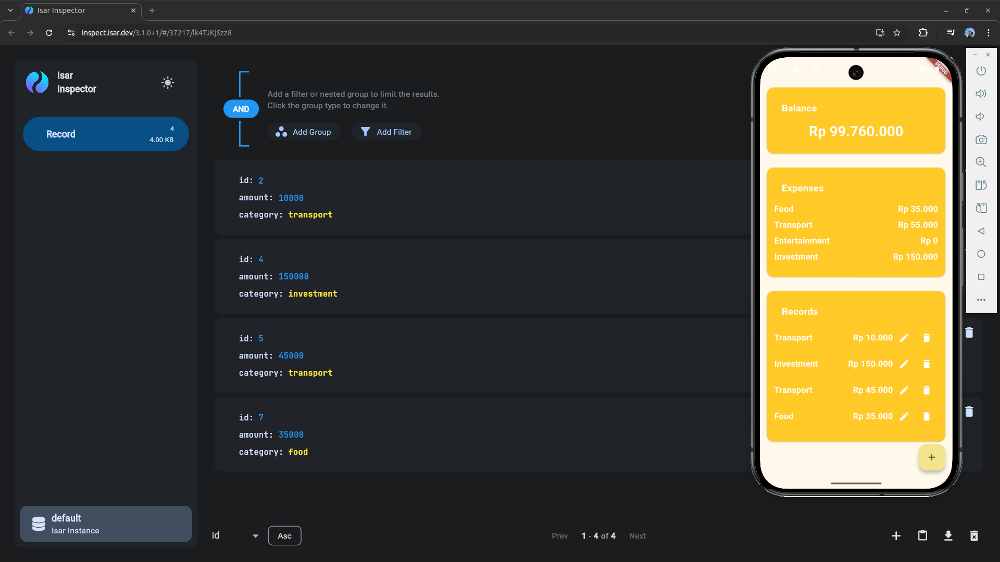

# Flutter with Isar Database

| Name                | NRP        | Kelas                            |
| ------------------- | ---------- | -------------------------------- |
| Adnan Abdullah Juan | 5025221155 | Pemrograman Perangkat Bergerak C |

Tugas ini merupakan implementasi database pada flutter menggunakan Isar database. CRUD akan diterapkan pada project ini. Pembuatan UI aplikasi mobile menggunakan project sebelumnya, namun untuk menyimpan data yang sebelumnya menggunakan List diubah menggunakan Isar Database.

### Sneakpeak



### UI Aplikasi Mobile

```sh
git clone https://github.com/Djuanzz/ppb-expense-tracker
```

Project tersebut telah menerapkan CRUD menggunakan list untuk kasus Expense Tracker (pencatatan pengeluaran).

### Isar Database

Isar merupakan sebuah database NoSQL yang dirancang pada flutter dengan tujuan utama memberikan performa tinggi, kemudahan pengguna, dan kompatibilitas lintas platform

### Instalasi Isar Database

```
flutter pub add isar isar_flutter_libs path_provider
flutter pub add -d isar_generator build_runner
```

Instalasi isar database dapat menjalankan perintah tersebut untuk menambahkan beberapa package pada file `pubspec.yaml` sehingga file tersebut akan menambah beberapa dependencies seperti berikut:

```yaml
dependencies:
  flutter:
    sdk: flutter

  cupertino_icons: ^1.0.8
  isar: ^3.1.0+1
  path_provider: ^2.1.5
  isar_flutter_libs: ^3.1.0+1

dev_dependencies:
  flutter_test:
    sdk: flutter

  flutter_lints: ^5.0.0
  isar_generator: ^3.1.0+1
  build_runner: ^2.4.13
```

### Pembuatan Collection

```dart
import 'package:expense_tracker/models/enums.dart';
import 'package:isar/isar.dart';

part 'record.g.dart';

@Collection()
class Record {
  Id id = Isar.autoIncrement;

  int amount;

  @enumerated
  Category category;

  Record({required this.amount, required this.category});
}

```

Code tersebut merupakan pembuatan collection / schema. Saya membuat collection dengan nama Record untuk menyimpan data expense record pada aplikasi.

Setelah pembuatan collection dilakukan, jangan lupa untuk menambahkan baris code seperti berikut:

```dart
part 'record.g.dart';
```

Code tersebut digunakan untuk melakukan build schema yang telah kita buat dan akan disimpan pada file `record.g.dart`

Kemudian jalankan perintah berikut untuk menjalankan code generator pada isar database

```sh
flutter pub run build_runner build
```

### Database Service

```dart
import 'package:expense_tracker/models/record.dart';
import 'package:isar/isar.dart';
import 'package:path_provider/path_provider.dart';

class DatabaseService {
  static late final Isar db;

  static Future<void> setupDatabase() async {
    final appDir = await getApplicationDocumentsDirectory();
    db = await Isar.open([RecordSchema], directory: appDir.path);
  }
}
```

Code tersebut bertanggung jawab untuk berinteraksi dengan Isar Databae

```dart
void main() async {
  await _setupDatabase();
  runApp(const MyApp());
}

Future<void> _setupDatabase() async {
  WidgetsFlutterBinding.ensureInitialized();
  await DatabaseService.setupDatabase();
}
```

Dengan database service tersebut, kita bisa menggunakan databasenya setelah dipanggil di `main.dart`

### Implementasi CRUD

#### Create Record

Pengimplementasian create / insert pada isar database dapat menggunakan build in method pada isar yaitu `.put()` digunakan untuk menambahkan data record ke dalam database

```dart
  void addRecord(String category, int amount) async {
    final newRecord = Record(
      amount: amount,
      category: Category.values.firstWhere(
        (c) => c.name.toLowerCase() == category.toLowerCase(),
      ),
    );

    await DatabaseService.db.writeTxn(() async {
      await DatabaseService.db.records.put(newRecord);
    });

    await loadRecordsFromDb();
  }
```

#### Delete Record

Pengimplementasian delete pada isar database dapat menggunakan build in method pada isar yaitu `.delete()` digunakan untuk menghapus data record ke dalam database

```dart
  void deleteRecord(int index) async {
    final dbRecords = await DatabaseService.db.records.where().findAll();

    if (index >= dbRecords.length) return;

    await DatabaseService.db.writeTxn(() async {
      await DatabaseService.db.records.delete(dbRecords[index].id);
    });

    await loadRecordsFromDb();
  }
```

#### Get Record

Pengimplementasian get pada isar database dapat menggunakan beberapa build in method pada isar seperti `.get()`, `.where()`, dan `.filter()` tergantung keperluan yang dihadapi / tergantung query object yang diperlukan

```dart
  Future<void> loadRecordsFromDb() async {
    final dbRecords = await DatabaseService.db.records.where().findAll();

    setState(() {
      records =
          dbRecords
              .map(
                (r) => {
                  'category':
                      r.category.name[0].toUpperCase() +
                      r.category.name.substring(1),
                  'amount': r.amount,
                },
              )
              .toList();

      balance = 100000000;
      for (var r in dbRecords) {
        balance -= r.amount;
      }

      for (var expense in expenses) {
        expense['amount'] = dbRecords
            .where((r) => r.category.name == expense['category'].toLowerCase())
            .fold(0, (sum, r) => sum + r.amount);
      }
    });
  }
```
